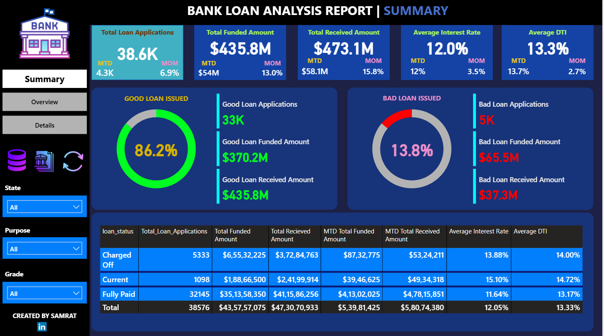
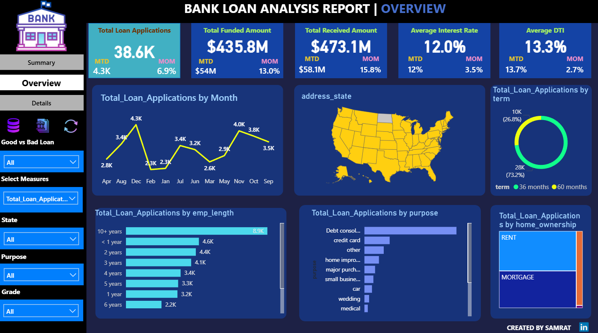

# Bank-Loan-Data-Analysis_PowerBI_and_MS-SQL-SERVER
## 📁 Project Overview

This project involves the analysis of a bank’s loan dataset using **MS SQL Server** for data querying, **Excel** for preprocessing, and **Power BI** for KPI dashboarding and data visualization.

Key goals:
- Identify loan performance trends
- Discover insights on default risk, recovery rates, and profitability
- Recommend strategies to improve loan recovery and bank revenue

---

## 🧮 Tools & Technologies Used

- **MS SQL Server** – For writing and executing over 25+ SQL queries to extract KPIs
- **Microsoft Excel** – For initial data cleaning (missing values, formatting)
- **Power BI** – For visualizing 10+ KPIs in 3 interactive dashboards
- **Word & PPT** – Documentation of query outputs and dashboards

---

## 📌 Key KPIs & Insights

### ✅ Loan Volume and Growth

- Total Applications: **38,576**
- Highest monthly applications: **4,314 in Dec 2021**
- Growth observed from Nov (4,035) to Dec (4,314)

### ✅ Loan Amounts and Recovery

- Total Funded: **$435,757,075**
- Total Received: **$473,070,933**
- Profit on good loans: **17.71%**
- Loss on bad loans: **43.10%**

### ✅ Risk Factors

- Average Interest Rate: **12.05%**
- Average DTI: **13.33%**
- Dec 2021 had highest DTI (13.67%) and Interest Rate (12.36%)

### ✅ Loan Performance Breakdown

- **86%** of loans are "Fully Paid" or "Current"
- **13%** are "Charged Off" (Bad Loans)
- Majority of loans taken for **debt consolidation**

---

## 📌 Data-Driven Suggestions for Better Recovery

### 📍 Refine Approval & Risk Assessment

- Improve credit scoring and tighten income verification
- Monitor high DTI ratios before approving loans
- Price loans according to risk tier (grade/sub-grade)

### 📍 Enhance Loan Monitoring

- Set up early warning systems for risky loans
- Offer flexible repayment and restructuring for struggling borrowers

### 📍 Optimize Portfolio

- Focus on loan types with high repayment rates
- Diversify loan allocation across states/sectors

### 📍 Leverage Tech & Analytics

- Use predictive analytics for borrower behavior
- Automate parts of loan processing and reminders

---

## 📊 Power BI Dashboards

### 🔹 Dashboard 1: Monthly Loan Application & Funding Trends  

### 🔹 Dashboard 2: Loan Status, Profitability & Risk Profile  

### 🔹 Dashboard 3: KPI Overview with Filters (State, Term, Purpose)  

> Dashboards are embedded in the `.pptx` file shared in the repository.  

---

## 🧾 SQL Query Documentation

The SQL scripts (25+ queries) used to extract KPIs are saved in a `.pdf` file along with actual outputs.

**

Sample included queries:
- Total loan applications and amount
- Monthly funded vs. received
- Avg interest & DTI by month
- Loan classification by grade/status

---

## 🛠️ Setup Guide to Explore Locally

### ✅ Prerequisites

- Microsoft SQL Server (Express or Developer edition)
- SQL Server Management Studio (SSMS)
- Microsoft Excel (any version)
- Power BI Desktop

### 🔻 Steps to Run

1. **Clone or Download this Repository**

git clone 
Set up SQL Server

Create a new database LoanDB

Use Excel to clean the raw CSV (optional)

Import the cleaned dataset into LoanDB

Run SQL Scripts

Open SQL_Insights_Report.docx

Copy queries into SSMS and run to view outputs

Open Power BI Dashboards

Launch Power BI Desktop

Open .pbix file (provided optionally if requested)

Explore dashboard filters and charts interactively

### 📂 File Structure

📁 Bank-Loan-Data-Analysis/
│
├── images/
│   ├── dashboard_monthly_trend.png
│   ├── dashboard_loan_status.png
│   ├── dashboard_kpi_overview.png
│
├── Loan_Analysis_Dashboard.pptx
├── SQL_Insights_Report.docx
├── cleaned_loan_data.xlsx
├── README.md
### 💬 Feedback & Contributions
Feel free to open issues or PRs if you'd like to add enhancements to the dashboards, suggest new queries, or improve the documentation.

